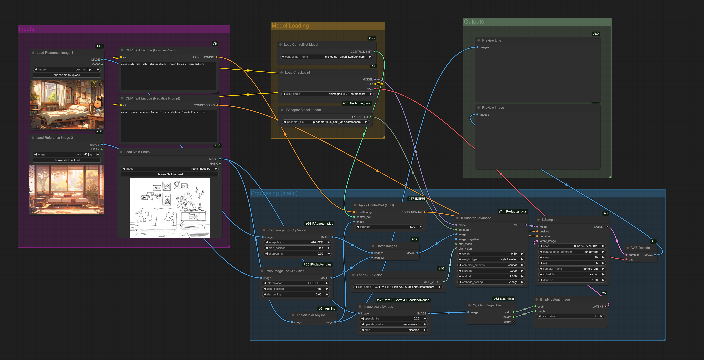
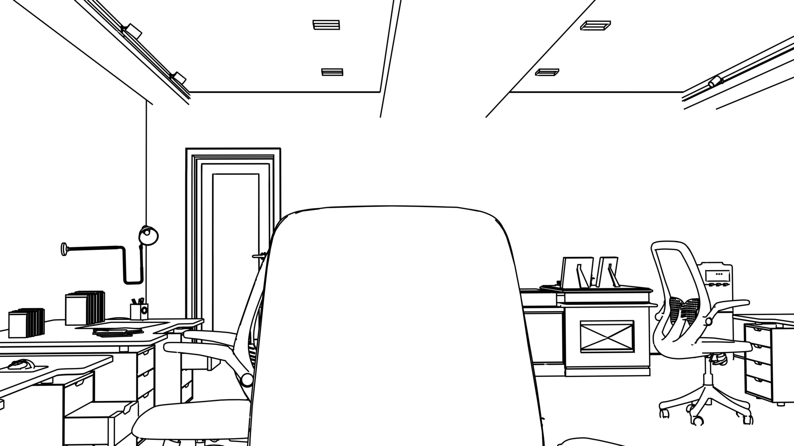
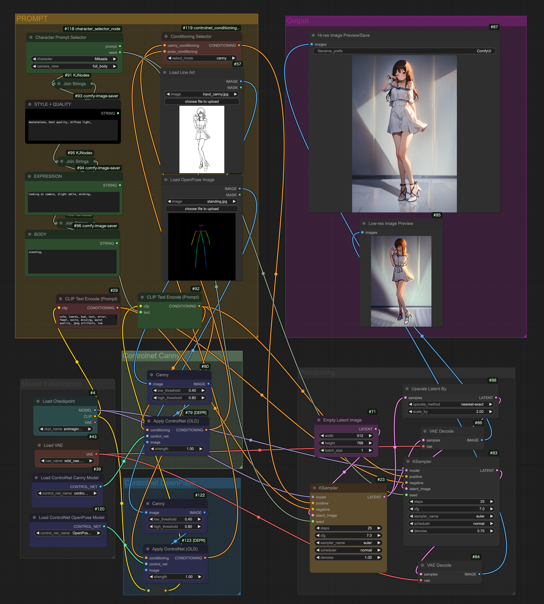
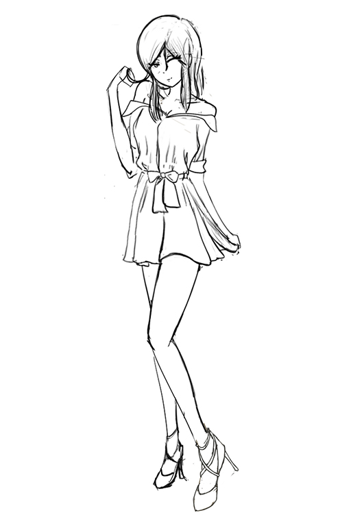
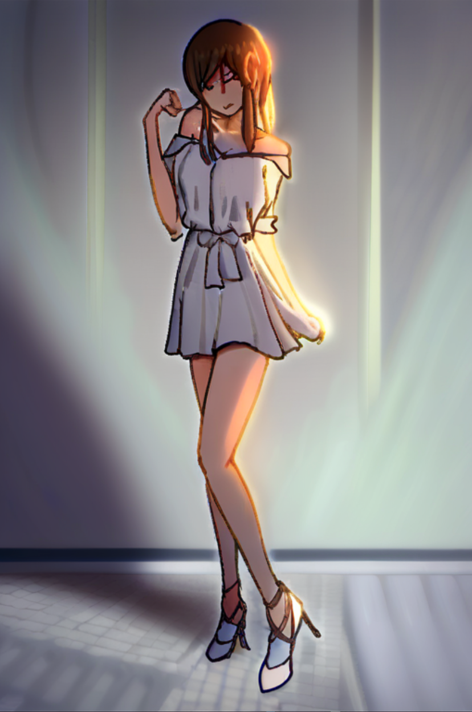
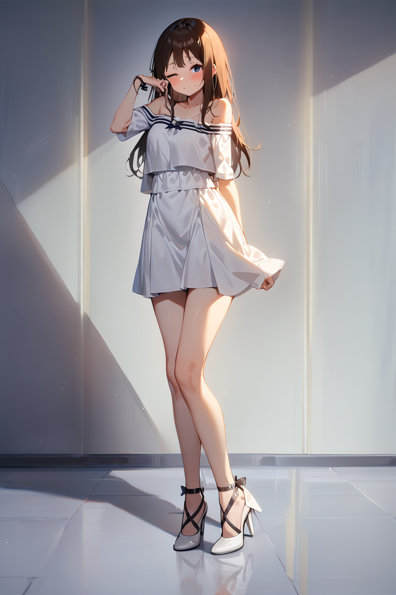

# ComfyUI Workflows

### [01] [`background`](background/README.md): Generate a background from 2 reference photos for style, and an input reference photo using an SDXL model of your choice.

##### Workflow Preview

##### Input Line

##### Output BG

### [02] [`character`](character/README.md): Generate and easily select from multiple character prompt settings to generate from an input rough canny or OpenPose pose using an SDXL model of your choice.

##### Workflow Preview

##### Input Canny

##### Mid-output (low-res)

##### Final Output (hi-res)

